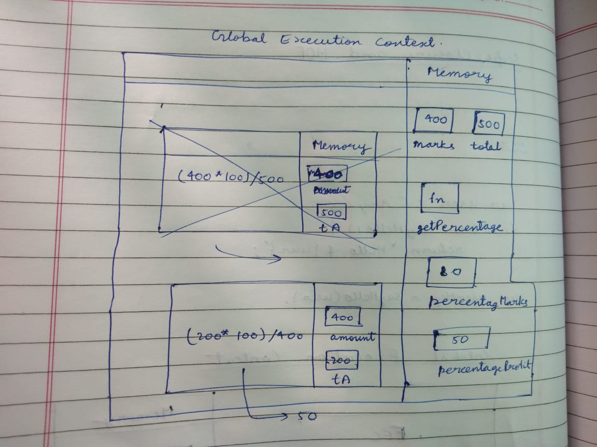

1. What does thread of execution means in JavaScript?
// When JavaScripts engine executes the code line by line is known by thread of execution. 
2. Where the JavaScript code gets executed?
// JavaScript code get executed into Global execution context. 
3. What does context means in Global Execution Context?
// The context mean where the invironment in which you are executing the code.
4. When do you create a global execution context.
// global execution context get created inside the javascript engine whenever it is running the code.
5. Execution context consists of what all things?
// two part one where we store memory like variables and functions. and second where we execute our code.
6. What are the different types of execution context?
// global execution context and function execution context.
7. When global and function execution context gets created?
// Global execution context get created by javascript befor execting any peace of code and function execution 
   context get created when calling a function.
8. Function execution gets created during function execution or while declaring a function.
// during function execution.

9. Create a execution context diagram of the following code on your notebook. Take a screenshot/photo and store it in the folder named `img`. Use `` to display it here.


```js
var user = "Arya";

function sayHello(){
  return `Hello ${user}`;
}

var userMsg = sayHello(user);
```

<!-- Put your image here -->


```js
var marks = 400;
var total = 500;

function getPercentage(amount, totalAmount){
  return (amount * 100) / totalAmount;
}

var percentageMarks = getPercentage(marks, total);
var percentageProfit = getPercentage(400, 200);
```

<!-- Put your image here -->




```js
var age = 21;

function customeMessage(userAge){
  if(userAge > 18){
    return `You are an adult`;
  }else {
    return `You are a kid`;
  }
}

var whoAmI = customeMessage(age);
var whoAmIAgain = customeMessage(12);
```

<!-- Put your image here -->

